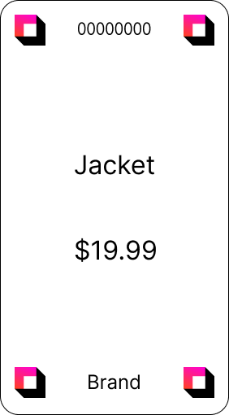
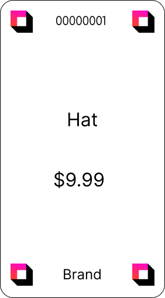
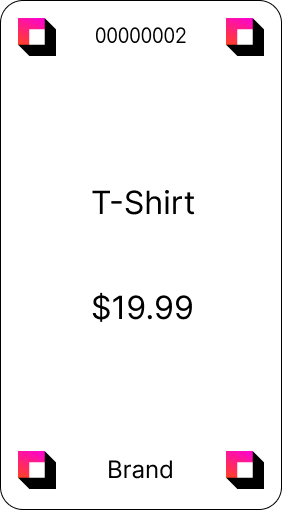
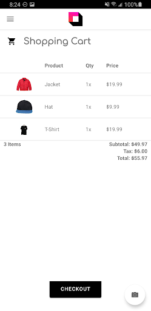
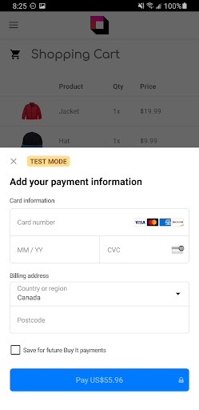
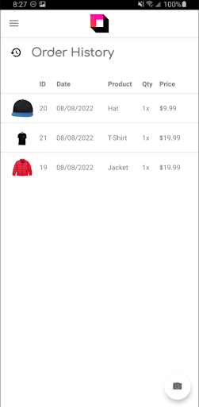

# Buy-It Android Application

Buy-It is an Android application designed to streamline the shopping experience and reduce the burden on point-of-sale systems for small businesses. It allows businesses to create their own products and add them to their listings. Shoppers can then scan these product codes, add products to a shopping cart, and manage their purchases. The goal of this app was to create a mobile checkout system to allow shoppers to easily purchase items in a store. The product scanning feature is powered by Google's ML Kit.

## Features

- **Product Management for Businesses**: Businesses can create their own products and add them to their listings. This allows for a flexible and dynamic product management system tailored to the needs of small businesses.
- **Product Scanning**: Shoppers can scan product codes to retrieve information about products. This scanning feature uses Google's ML Kit for efficient and accurate barcode recognition.
- **Shopping Cart**: Shoppers can add products to a cart and manage their selections before finalizing their purchases. This feature enables a mobile checkout experience that reduces the burden on traditional point-of-sale systems.
- **Product Gallery**: The app includes a gallery showcasing all available products. This provides shoppers with an easy way to browse items available for purchase.
- **Login and Logout Functionality**: The app supports user authentication, allowing for personalized shopping experiences.

## App Structure

The app is structured following standard Android app conventions. Here's a high-level overview:

### Source Code (`app/src/main/java`)

The Java source code for the app is located in the `app/src/main/java` directory. The primary package is `com.buyit`.

#### Key Components

- `Product.kt`: Defines the `Product` class, which represents a product.
- `MainActivity.kt`: Contains UI logic for the app's main screen.
- `Util.kt`: Contains utility methods used throughout the application.
- `CartAdapter.kt`: An adapter for displaying items in the shopping cart.
- `ProductActivity.kt`: An activity for displaying a single product.
- `ProductAdapter.kt`: An adapter for displaying product items in a list or grid.
- `AddNewProductActivity.kt`: An activity for adding a new product.

The package also includes the following subpackages:

- `ui`: Contains classes for different UI components of the app, divided into `home`, `login`, `logout`, `settings`, and `gallery` modules.
- `database`: Contains classes for handling data storage, such as `CartDao.kt`, `Converters.kt`, `CartRepository.kt`, `CartViewModel.kt`, `Cart.kt`, and `CartDatabase.kt`.

### Resources (`app/src/main/res`)

The `app/src/main/res` directory contains resources such as images, XML layouts, UI strings, and styles.

## Getting Started

Download the apk here: https://github.com/PrabhKahlon/buy-it/releases/tag/APK

To run the application locally, follow these steps:

1. Clone the repository: `git clone https://github.com/PrabhKahlon/buy-it.git`
2. Open the folder with Android Studio
3. Run the project using either the built-in android emulator or a connected android device

## Presentation

A presentation about the app can be found here: https://docs.google.com/presentation/d/1AbKMtFbFlsgzgHkGwovY8MSJ8JNgH_aGVIElxocfpt8/edit?usp=sharing

## Product Tag Examples

## Screenshots

